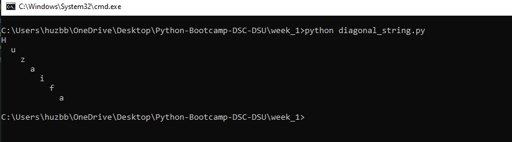
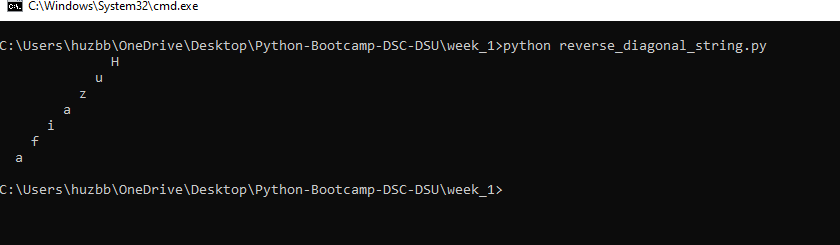
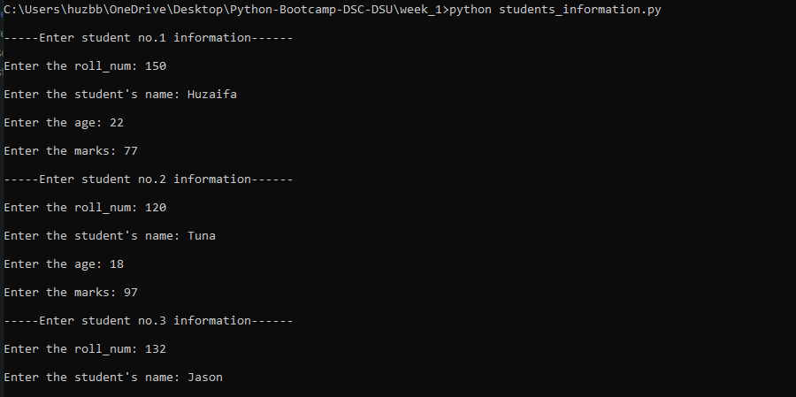
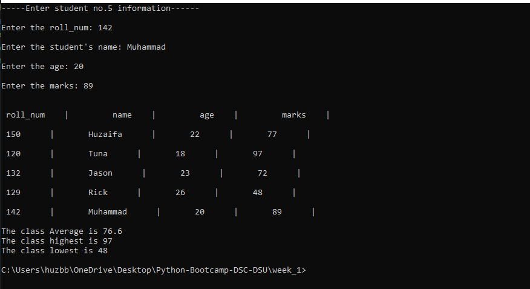
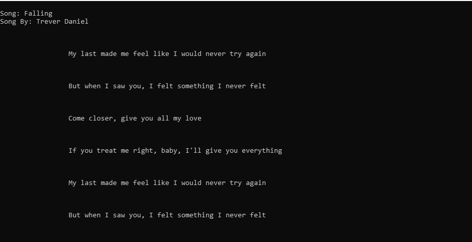

# DSC-DSU | Python Bootcamp 2020 | Week 1

Paste questions and brief writeup here

## I've added coments on each important line in scripts to show what is does

Q-1 | Print any name Diagonally and Reverse Diagonally?
 
    # iterating each charater one by one, the spaces will be added by +2 so the character moves to forward with newline
    # creating diagonal.
    spaces = 0   

    for s in string:
        print(' ' * spaces + s)
        spaces += 2

    

    
    # Similarly this time I've taken lenght of entire string and multiplied by 2 and starting displaying character from end and subtracting -2 each character.

    spaces = len(string) * 2

    for s in string:
        print(' ' * spaces + s)
        spaces -= 2

    

Q-2 | Create a program to take as input 5 student records in the following format:
        **roll_num** | **name** | **age** | **marks**(out of 100)
        And then output the records in a tabular form with class average, class highest and class lowest at end in the following format.

        Use dictionaries (list of dictionaries in exact)
        Insert atleast 5 records
        Input must be user-given
        (Optional) validate the user input, i.e marks aren't greater 100 and other such validations you think there might be

        
        

Q-3 | Any Song lyrics after 1 Second.

    