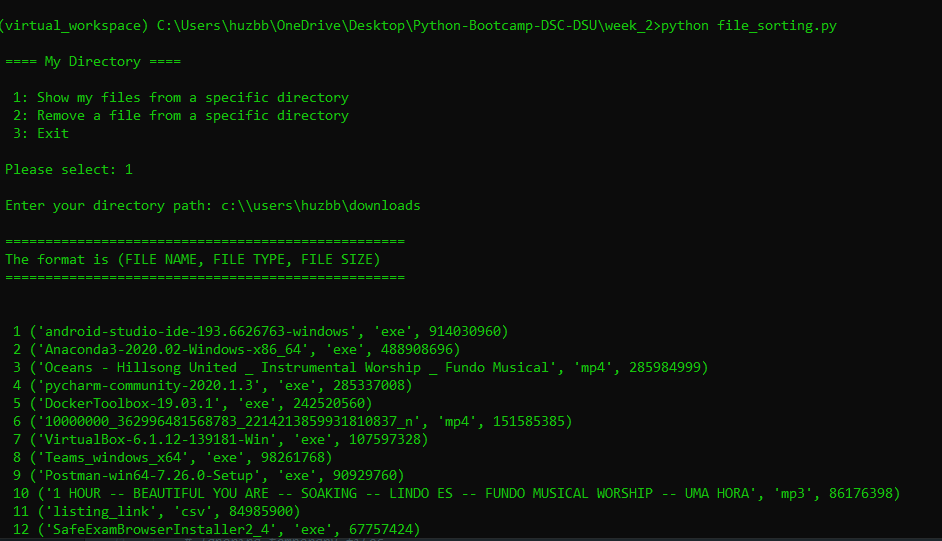
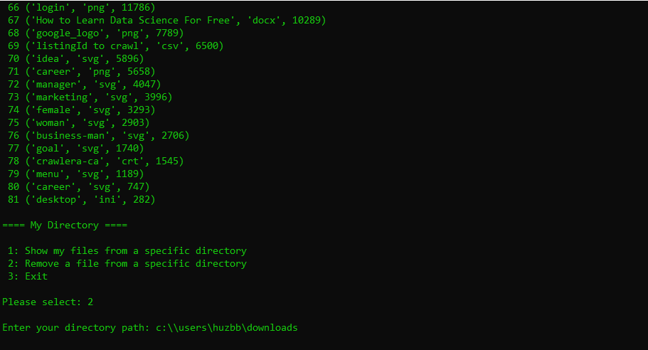
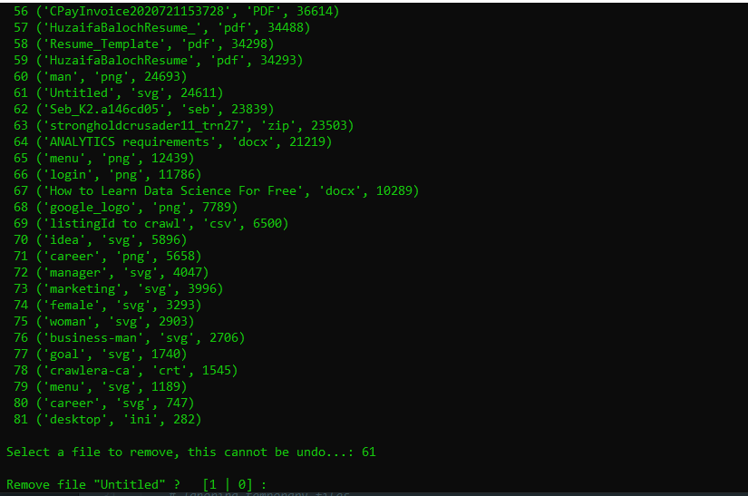
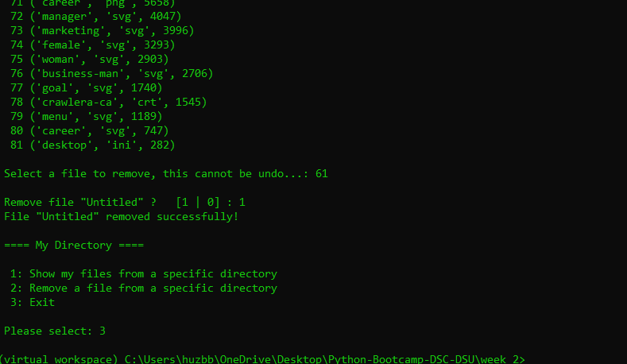
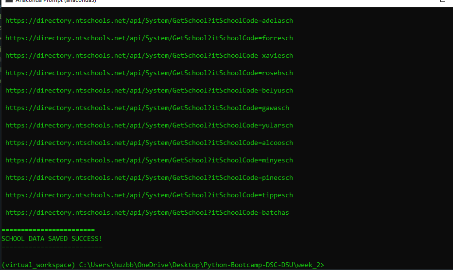
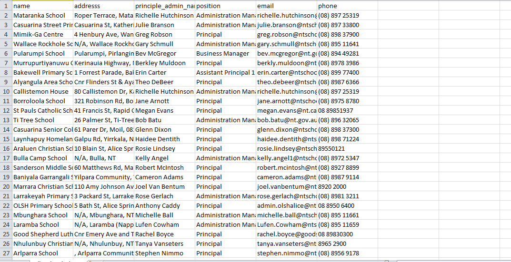
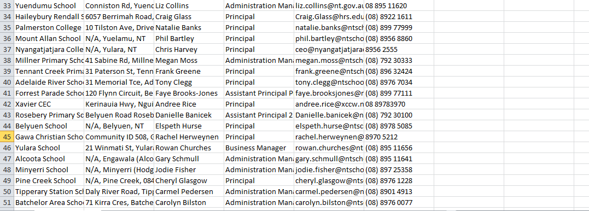

# DSC-DSU | Python Bootcamp 2020 | Week 2

## I've added coments on each important line in scripts to show what is does

### 1. Take as user input a folder path and print all the files in descending order of their respective sizes

#### I've also done the optional part where you can remove any file from any directory

    

### 2. Build a Facebook bot that will retrieve the number of likes a Facebook page. Input Facebook page handles using CSVs

### 3. Build a school scraper that'll scrap 50 schools' info and generate a CSV.

