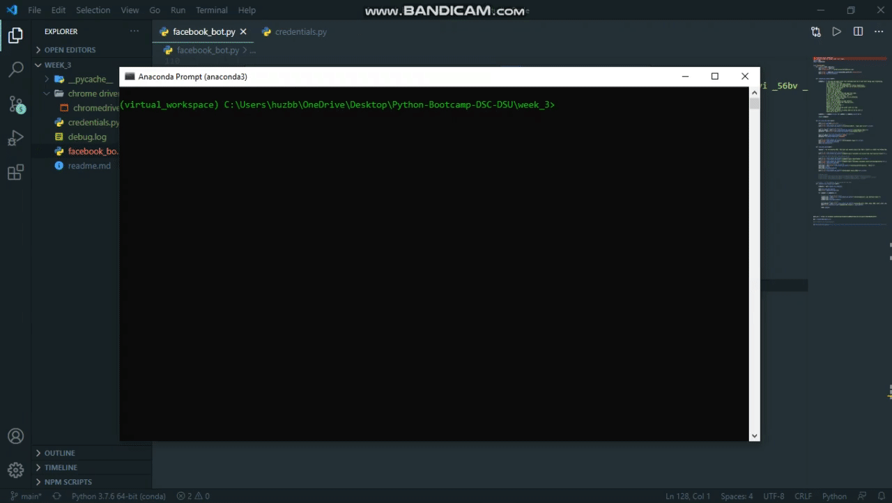
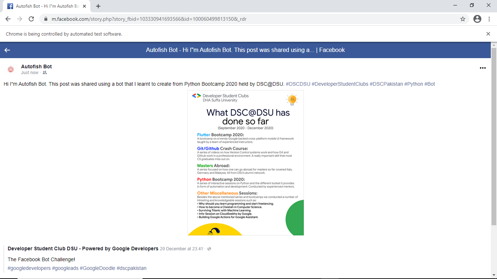
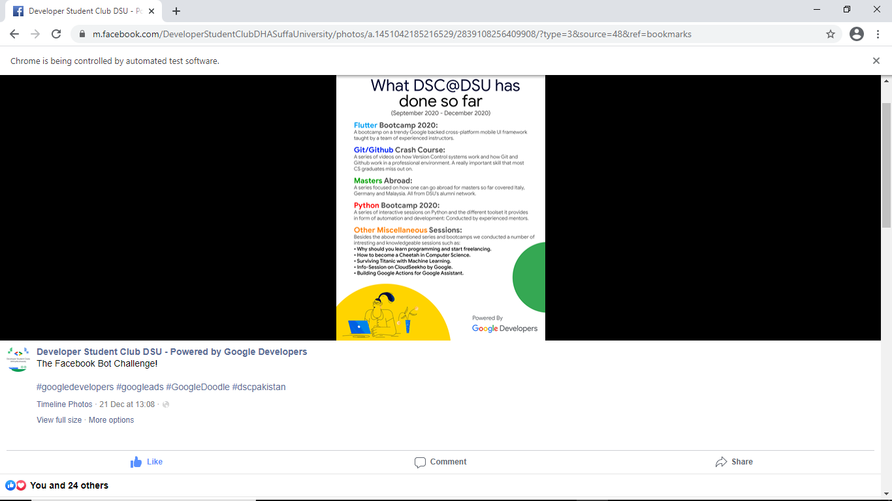
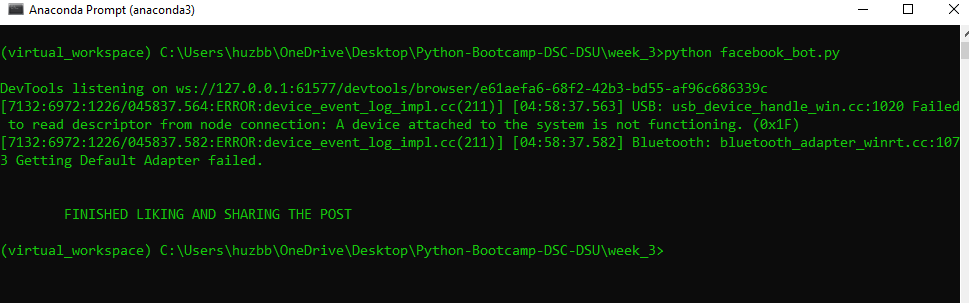
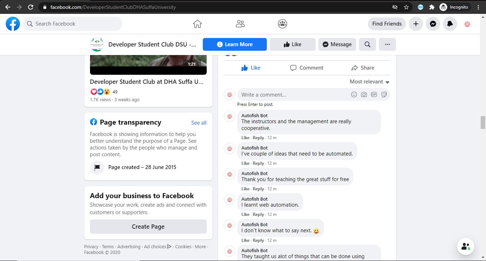

# DSC-DSU | Python Bootcamp 2020 | Week 3

## I've added coments on each important line in scripts to show what is does

### 1. Take as user input a Facebook post link and have your bot like the post and share it on your timeline

### 1. Optional, extra marks: make the bot created above make at least 50 comments in succession on the page. These 50 comments should be lines split from a paragraph you may write on

